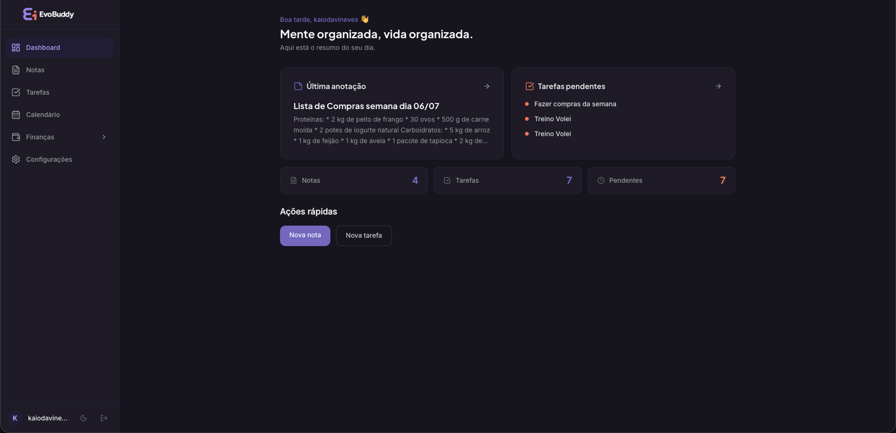
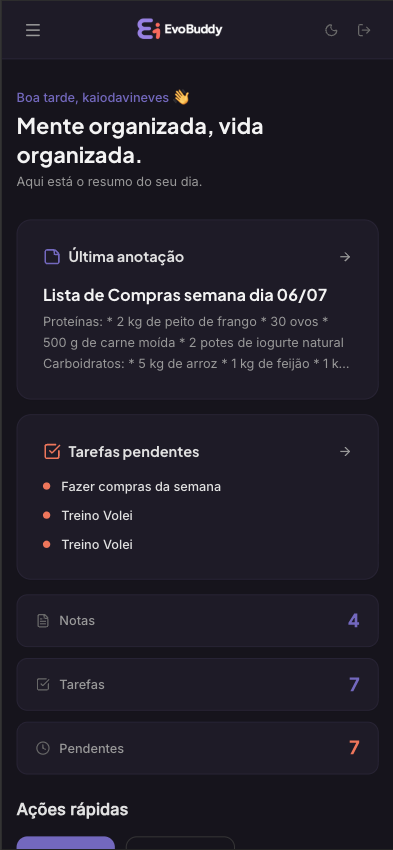
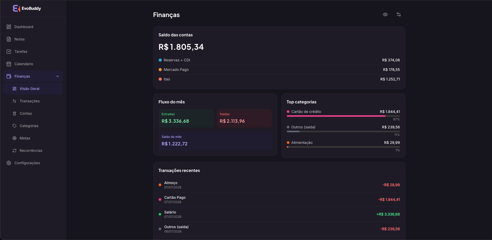
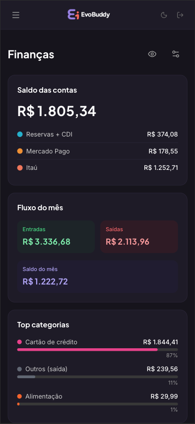

# EvoBuddy

A personal productivity app for notes, tasks, calendar, and finances — all in one place, from any device, without installing anything.

**Live at [bitsautomacoes.site](https://bitsautomacoes.site)** · React 19 · Node.js + Express · PostgreSQL

---

## What this is

I got tired of switching between different apps for things that should live together. EvoBuddy covers notes, tasks (with time tracking), a calendar that creates linked tasks from events, and financial tracking with bank integration via Pluggy.

The most deliberate design decision: **no native apps**. No React Native, no Electron. One responsive SPA that works on your phone, tablet, and laptop — single codebase, single deploy, no App Store.

---

## Screenshots

| Desktop | Mobile |
|---|---|
|  |  |
|  |  |

---

## Architecture

```
Browser (React SPA)
  │
  ├── Auth only ──────────► Supabase Auth (Magic Link / Google / GitHub)
  │
  └── All data ───────────► Express API (packages/api)
                                └── Supabase Admin Client
                                      └── PostgreSQL (RLS per user)
```

The frontend never reads or writes data directly. Everything goes through the Express backend, which uses a `service_role` key that stays server-side. The Supabase client on the browser is only for authentication.

Most Supabase tutorials tell you to hit the database directly from the frontend. I didn't, because it means every rate limit, validation rule, and business logic runs on the server — not in JavaScript anyone can open and inspect.

---

## Decisions that shaped it

**Web-only instead of React Native + Electron**

Maintaining three separate codebases for the same product didn't make sense for a solo project. A mobile-first responsive SPA covers the real usage. The tradeoff is native performance for gestures and animations — acceptable for a productivity tool.

**API as proxy, not Supabase direct**

The `service_role` key bypasses Row Level Security entirely. Keeping it server-side let me add Helmet, CORS restrictions, rate limiting (100 req/min global, 5 req/min on auth routes), and Zod validation on every route without any of that being bypassable from the client.

**ULID instead of UUID**

ULIDs are sortable by creation time, so `ORDER BY created_at` index scans are friendlier. They can also be generated in the browser before the API responds — which is what enables optimistic updates without waiting for a round trip.

**Zustand as cache, not source of truth**

State lives in PostgreSQL. Zustand holds a local copy for instant UI updates. On mutation: update Zustand immediately, call the API, roll back on failure. On page load: fetch from API, hydrate the store. This sidesteps the entire class of problems that come from treating local state as canonical.

**No soft-delete**

Soft-delete makes sense when you need sync — it prevents "resurrection conflicts" when two devices delete and recreate the same record. This app has no local persistence and no P2P sync. A real `DELETE` is simpler and there's nothing to conflict with.

**Single schema for front and back**

Zod schemas live in `packages/shared` and are imported by both the React app and the Express API. The same `TaskSchema` that validates the form input is the one that validates what comes out of the database. No type drift between layers.

---

## Stack

| Layer | Technology |
|---|---|
| Frontend | React 19, Vite, TailwindCSS |
| State | Zustand (UI cache only) |
| Validation | Zod (shared schemas across front and back) |
| Backend | Node.js, Express |
| Auth | Supabase Auth — Magic Link, Google, GitHub |
| Database | PostgreSQL via Supabase (RLS on every table) |
| Security | Helmet, CORS, rate limiting, Zod middleware, JWT verification |
| Monorepo | pnpm workspaces + Turborepo |
| Deploy | Docker multi-stage + nginx, VPS |

---

## Running locally

```bash
pnpm install
```

Create `apps/web/.env`:

```env
VITE_SUPABASE_URL=...
VITE_SUPABASE_ANON_KEY=...
VITE_API_URL=http://localhost:3001
```

```bash
pnpm dev   # web on :5173, api on :3001
```

---

## What's next

- AI assistant layer (Ollama local / OpenAI remote) — opt-in, the app works without it
- Full-text search across notes and tasks
- PWA / offline read mode — undecided, it complicates things
